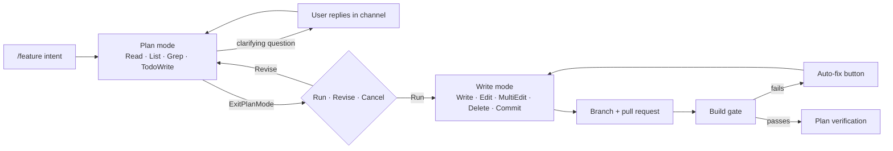

# Onyx

[](https://github.com/TheDLCrimson/Onyx/actions/workflows/ci.yml)
[](LICENSE)

**A self-hostable Discord coding agent that runs AI coding workflows through OpenRouter.**

Describe a feature in a Discord channel.
Onyx explores your GitHub repo, drafts a plan, and waits for you to click **Run**.
Then it writes the code on a branch, checks that it still builds, and opens a pull request for you to review.
It works with any tool-calling model on OpenRouter, from Claude to free models.

Onyx began as a private bot for a small group of friends, running on the maintainer's own API key against their real projects.
It has done real work on real repositories, but it is a tool you run yourself, not a hosted service.
You bring your own Discord bot, OpenRouter key, and GitHub token.

## What a session looks like

```
You:  /feature add a feedback button to the homepage
Onyx: 🧠 Plan in progress - add a feedback button to the homepage
      🔧 List src/pages … 🔧 Read src/pages/HomePage.tsx …
Onyx: I found the homepage in src/pages/HomePage.tsx.
      Should the feedback button open (a) a modal or (b) a link to a form?
You:  a modal, bottom right corner
Onyx: 📋 Plan ready
      1. Create src/components/FeedbackButton.tsx
      2. Add the modal and its styles
      3. Render it on HomePage.tsx
      [✅ Run] [✏️ Revise] [❌ Cancel]
You:  (clicks ✅ Run)
Onyx: ☑ progress checklist, live-updated
      📎 Opened PR #42 - https://github.com/you/your-app/pull/42
      ✅ Build passed (tsc) · ✅ Verification: execution matched the plan
```

You review and merge the pull request on GitHub as usual.
Follow-ups like `/refine make the button purple` land on the same pull request.

## Features

- **Plan first, write second.** `/feature` starts in a read-only plan mode; write tools are blocked at the dispatcher until you approve the plan.
- **Discord-native control.** Approve, revise, cancel, continue, and retry are buttons; clarifying questions are answered with plain replies in the channel.
- **One pull request per feature.** The branch and pull request are created on the first write, and later `/refine`, `/create`, and `/edit` calls add to them.
- **Build gate with auto-fix.** After each run Onyx clones the branch and checks it with `tsc`, `pyright`, or `dotnet build`; failures go into the PR body with an **Auto-fix** button.
- **Plan verification.** A cheap model compares the approved plan with what actually changed and records the verdict in the pull request.
- **Careful with large files.** Paginated reads, a shrink guard against rewriting a file from a partial read, and all-or-nothing multi-edits.
- **Survives restarts and flaky models.** Runs are checkpointed after every step, so after a crash, redeploy, or failed model call you continue where it stopped.
- **Budgets and spend caps.** Each run has a read/write/token budget with a wrap-up reserve, every model call's cost is logged, and an optional per-channel daily USD cap stops runaway spend.
- **Any model, with fallbacks.** One model or an ordered fallback list per tier; Anthropic models get prompt caching automatically.

## Quick start

You need Node.js 22 (or Docker), a Discord application, an OpenRouter API key, and a GitHub token.
The full walkthrough, including the Discord developer portal settings, is in [docs/self-hosting.md](docs/self-hosting.md).

```bash
git clone https://github.com/TheDLCrimson/Onyx.git
cd Onyx
cp .env.example .env    # fill in DISCORD_TOKEN, DISCORD_CLIENT_ID, OPENROUTER_API_KEY, GITHUB_TOKEN
docker compose up -d --build
```

Without Docker, run `pnpm install && pnpm build && pnpm start` instead.

At startup Onyx logs an invite URL for your bot.
Add the bot to your server, then run this in a channel:

```
/repo set owner:<owner> repo:<repo>
/feature add a dark mode toggle to the settings page
```

## Choosing models

Onyx has two model tiers, both configured in `.env`:

| Variable | Used for | Default |
| --- | --- | --- |
| `ONYX_MODEL` | Agent loop and code generation | `anthropic/claude-sonnet-4.6` |
| `ONYX_MODEL_LIGHT` | PR summaries, plan verification, single-file Q&A | `anthropic/claude-haiku-4.5` |

Any [OpenRouter model](https://openrouter.ai/models) works, but every model in the heavy tier must support tool calling.
A comma-separated list of up to three ids becomes an ordered fallback chain, used when a model is rate-limited or down:

```bash
ONYX_MODEL=nex-agi/nex-n2.5-pro:free,poolside/laguna-s-2.1:free,dots-studio/dots-3-note-preview:free
ONYX_MODEL_LIGHT=nvidia/nemotron-3-super-120b-a12b:free,cohere/north-mini-code:free,dots-studio/dots-3-note-preview:free
```

Free models cost nothing and are fine for trying Onyx out, but expect rate limits and weaker plans.
How good a `/feature` run is depends mostly on the heavy model.
The free models above are examples; the free lineup changes often, so check OpenRouter before relying on one.

## Commands

| Command | What it does |
| --- | --- |
| `/feature <intent>` | Plan a multi-file change, wait for approval, execute it, open a PR |
| `/refine <intent>` | Make a focused follow-up change to the active feature's PR |
| `/ask <question>` | Answer a question about the repo; remembers the conversation |
| `/btw <question>` | One-off question that leaves no trace in the conversation |
| `/create <path> <description>` | Generate a single new file |
| `/edit <path> <instruction>` | Change a single existing file |
| `/session` | Show the active feature, mode, PR link, and files touched |
| `/context` | Show conversation size, running-agent state, and 24h cost for the channel |
| `/compact` | Summarise older conversation history to free up context |
| `/reset` | End the channel's session (the PR stays open) |
| `/repo set\|show\|clear` | Bind this channel to a GitHub repo |
| `/start` | Setup checklist for a new channel |
| `/help` | Command list |

## How it works



The agent is a plain tool-calling loop over OpenRouter's OpenAI-compatible API.
Instead of a state machine, a session has one `mode` flag (`plan`, `pr`, or `direct`), and a single tool dispatcher refuses write tools while the mode is `plan`.
Pausing for a human is a flag on the tool (`ExitPlanMode` pauses the loop), so the loop itself stays small.
Every slash command, Discord event, and button handler is its own file.

The moving parts are small enough to read directly: `src/services/agent.ts` is the loop, `src/services/tools.ts` the dispatcher and its permission gate, and `src/runtime/featureRunner.ts` the one place Discord and the agent meet.

## Security and cost

Onyx acts with your credentials, so giving someone access to Onyx is like lending them your GitHub token and OpenRouter key.

- Anyone who can run its slash commands in a channel can make it read and change that channel's repo and spend your model credits.
  Restrict who can use it with Discord's per-command permissions, and keep **Public Bot** off in the developer portal.
- Scope the GitHub token to the repos Onyx should touch.
  Onyx never merges pull requests; `/feature` always works on its own branch.
- The build gate runs the repo's toolchain (`tsc`, `pyright`, `dotnet build`) on the machine Onyx runs on.
  Dependency installs skip lifecycle scripts, but build tools can still run code from the repo, so only bind repos you trust and prefer running Onyx in its container.
- Set a credit limit on your OpenRouter key, and `ONYX_CHANNEL_BUDGET_USD` for a per-channel daily cap.

## Development

```bash
pnpm install
pnpm dev                # run from source
pnpm test               # unit tests, no network
pnpm test:integration   # real OpenRouter + GitHub; see docs/design/testing.md
pnpm format             # prettier
```

See [CONTRIBUTING.md](CONTRIBUTING.md) for conventions.
Other docs:

- [docs/self-hosting.md](docs/self-hosting.md) - running your own instance
- [docs/onboarding.md](docs/onboarding.md) - for people using an instance someone else runs

## Limitations

- `Grep` uses GitHub code search: keyword matching on the default branch only, so it can't see the feature branch.
- `/ask` answers arrive as one message instead of streaming.
- Onyx has no per-user permissions of its own; access control is whatever Discord allows.
- A batch of staged changes lands as one commit per file (GitHub Contents API), not one atomic commit.
- It is a single Node process with JSON-file persistence, sized for a handful of users rather than a large community.

## License

[MIT](LICENSE)
